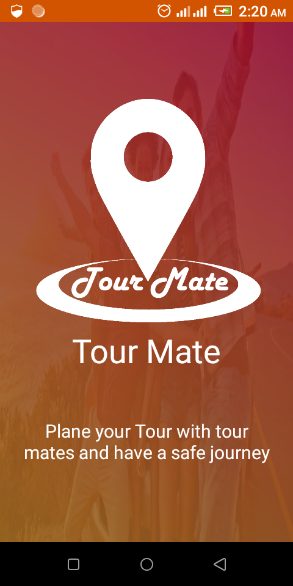

# TourMate
TourMate App for BITM final submission

# If you want to work with me, then follow some instruction that is given below
	1. Login your github account
	2. Fork TourMate repository
	3. Clone helper branch from here
 		$git clone -b helper https://github.com/ruhulrahman/TourMate.git
	
# Now work in your project and then follow some instructions for upload your whole files on github
	1. $git add .
	2. $git commit -m "write comment: specific work"
	3. $git push
	# If you don't config your Git Bash, then config your Git Bash by your github username and passwork
	
# Now You have to sent pull request for merge branch help with master. So folow this instructions
	1. git request-pull v1.0 https://github.com/ruhulrahman/TourMate.git helper
	(Mension that: v means verion. v1.0 means version 1.0 and helper is a branch)
# Now have to merge this repository from master branch. Command For merge this repository is given below
	1. git merge
# Now have to pull this repository
	1. git pull
